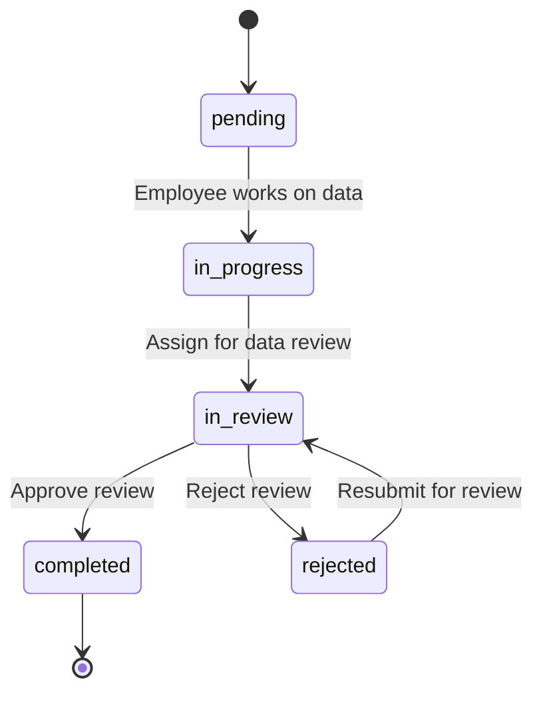

# `in_review` Status — ClearClaim Documentation

This document describes how the **`in_review`** status works across the ClearClaim backend and frontend. It covers company-level data review, related case workflows, API endpoints, UI surfaces, permissions, and status transitions.

---

## Table of Contents

1. [Overview](#overview)
2. [Status Definition](#status-definition)
3. [Lifecycle & Flow](#lifecycle--flow)
4. [Backend API Reference](#backend-api-reference)
5. [Permissions & Locks](#permissions--locks)
6. [Frontend Surfaces](#frontend-surfaces)
7. [Notifications & Dashboard](#notifications--dashboard)
8. [Case-Level `in_review`](#case-level-in_review)
9. [Template Review Interaction](#template-review-interaction)
10. [Source File Index](#source-file-index)

---

## Overview

`in_review` means a **company is under data review** (Excel / field data review). It is the primary status for the data-reviewer workflow.

| Property | Value |
|----------|-------|
| **Display name** | In Review / Under Review |
| **Internal value** | `in_review` |
| **Color** | `#7c3aed` (purple) |
| **Default SLA** | 2 deadline days |
| **Assigned via** | `assigned_to` (data reviewer user ID) |

### What `in_review` is used for

- Queue companies waiting for **data reviewer** approval
- Lock employee edits while review is in progress
- Drive sidebar badges, dashboard metrics, and reviewer stats
- Support admin case-review flows (case status can also be `in_review`)

### What `in_review` is **not**

- It is **not** the same as template review (templates use `template_reviewer_id` and `review_status` on `CompanyTemplate` in the modern schema)
- It is **not** the same as `excel_review` (a separate configurable company status in the extended workflow)

---

## Status Definition

Defined in `backend/src/constants/defaultCompanyStatuses.js`:

```js
{ name: 'In Review', value: 'in_review', color: '#7c3aed', deadline_days: 2 }
```

Also seeded as a default company status in `companyController.js`.

**Case model** (`backend/src/models/Case.js`) also supports `in_review` as a case-level status:

```
pending | assigned | in_review | completed
```

---

## Lifecycle & Flow

### Company data review flow

```
pending / in_progress
        │
        │  POST /companies/:id/assign-data-review
        │  (round-robin assigns data reviewer)
        ▼
    in_review  ─────────────────────────────────────┐
        │                                            │
        │  POST /companies/:id/approve-review        │  POST /companies/:id/reject-review
        ▼                                            ▼
   completed                                      rejected
        │                                            │
        │                                            │  Employee fixes data
        │                                            │  PATCH /companies/:id/status → in_review
        │                                            │  (resubmit)
        └────────────────────────────────────────────┘
```

### Mermaid diagram



### Entry conditions (assign for data review)

A company can enter `in_review` only when:

1. It is **not already** `in_review`
2. It has **at least one non-empty field value** (work data exists)
3. At least one **eligible data reviewer** exists (not the creator, template reviewer, or submitter)

On success:

- `status` → `in_review`
- `assigned_to` → selected data reviewer (round-robin)
- Notification sent to reviewer (`data_review_assigned`)

### Exit conditions

| Action | New company status | Notes |
|--------|-------------------|-------|
| Approve data review | `completed` | Employee notified (`data_review_approved`) |
| Reject data review | `rejected` | `assigned_to` reset to `created_by`; employee notified (`data_review_rejected`) |
| Resubmit (manual) | `in_review` | Via `PATCH /companies/:id/status` after fixes |

---

## Backend API Reference

All company routes require authentication (`auth` middleware).  
Base path: `/api/companies` (or your configured API prefix).

### Endpoints that set or depend on `in_review`

| Method | Endpoint | Purpose |
|--------|----------|---------|
| `POST` | `/:companyId/assign-data-review` | Assign company for data review → sets `in_review` |
| `POST` | `/:companyId/approve-review` | Approve data review → `completed` |
| `POST` | `/:companyId/reject-review` | Reject data review → `rejected` |
| `PATCH` | `/:companyId/status` | Manual status update (resubmit to `in_review`) |
| `PUT` | `/:companyId/values` | Blocked for non-reviewers while `in_review` |
| `POST` | `/:companyId/submit-template-review` | Legacy schema may set `in_review`; modern schema does not change status |
| `GET` | `/reviewer/stats` | Returns `inReview` count for assigned companies |
| `GET` | `/` | Filter companies by `?status=in_review` |

### `POST /:companyId/assign-data-review`

**Who can call:** Authenticated users with permission to assign review (typically employee/admin from Case Companies UI).

**Behavior:**

1. Validates company exists and is not already `in_review`
2. Validates company has work data
3. Finds eligible `data_reviewer` users (excludes creator, template reviewer, requester)
4. Picks reviewer via **round-robin** (based on most recent `in_review` assignment among eligible reviewers)
5. Updates company and creates notification

**Success response (200):**

```json
{
  "message": "Company assigned for data review successfully.",
  "company": { "...": "..." },
  "assigned_reviewer": {
    "id": 5,
    "name": "Reviewer Name",
    "email": "reviewer@example.com"
  },
  "assignment_method": "round_robin"
}
```

**Error responses:**

| Code | Condition |
|------|-----------|
| `400` | Already `in_review`, no work data, or no eligible reviewers |
| `404` | Company not found |
| `500` | Server error |

### `POST /:companyId/approve-review`

**Who can call:** `data_reviewer` or `template_reviewer` assigned to the company.

**Data reviewer path:** Sets `status` → `completed`, notifies creator.

### `POST /:companyId/reject-review`

**Who can call:** Assigned `data_reviewer` only.

**Body:**

```json
{
  "rejection_reason": "Optional reason text"
}
```

**Behavior:** Sets `status` → `rejected`, `assigned_to` → `created_by`, notifies employee.

### `PATCH /:companyId/status`

**Restriction while `in_review`:**

- `employee` and `sales` roles **cannot** change status unless they are the assigned reviewer with reviewer role
- Returns `403` with: *"Company status cannot be changed while it is under review."*

### `PUT /:companyId/values`

**Restriction while `in_review`:**

- Only assigned `data_reviewer` or `template_reviewer` can edit field values
- Others receive `403`: *"Company is locked while under review."*

### Round-robin logic

Implemented in `pickRoundRobinReviewerId()` (`companyController.js`):

1. Load eligible reviewer IDs
2. Find the most recently updated company with `status: in_review` assigned to any eligible reviewer
3. Assign the **next** reviewer in sorted ID order (wraps around)

---

## Permissions & Locks

### `canEditCompanyInReview(user, company)`

A user can edit a company in `in_review` only if:

- They have role `data_reviewer` **or** `template_reviewer`, **and**
- `company.assigned_to === user.id`

### Lock matrix

| Action | Employee / Sales | Admin (admin-only) | Assigned data reviewer |
|--------|------------------|--------------------|------------------------|
| Edit field values | ❌ Locked | ❌ Locked | ✅ Allowed |
| Change company status | ❌ Locked | ✅ Allowed | ✅ Allowed |
| Approve / reject review | ❌ | ❌ | ✅ |
| Assign for data review | ✅ (via UI) | ✅ | — |
| Select templates | ❌ Blocked in UI | ❌ Blocked in UI | N/A until approved |

### Frontend lock helpers

| Helper | File | Purpose |
|--------|------|---------|
| `isWorkLockedDuringReview()` | `CaseCompanies.jsx` | Locks pen/work/duplicate/delete |
| `isStatusLockedDuringReview()` | `CaseCompanies.jsx` | Locks status dropdown for employees |
| `isLockedDuringReview` | `CompanyWorkView.jsx` | Locks editing in work view |
| `isPendingExcelDataReview()` | `reviewAssignment.js` | Identifies Excel/data review queue items |

---

## Frontend Surfaces

### Routes

| Route | Component | `in_review` usage |
|-------|-----------|-------------------|
| `/data-review` | `DataReview.jsx` | Main data reviewer queue; default tab = `in_review` |
| `/template-review` | `TemplateReview.jsx` | Template queue; includes `in_review` tab |
| `/case-companies/:caseId` | `CaseCompanies.jsx` | Assign for review, show reviewer, work locks |
| `/company-work/:companyId` | `CompanyWorkView.jsx` | Approve/reject, resubmit, edit locks |
| `/manage-cases` | `ManageCases.jsx` | Default filter `in_review`; admin review modal |
| `/my-assigned-cases` | `MyAssignedCases.jsx` | Admin review when case is `in_review` |
| Admin dashboard | `AdminDashboard.jsx` | Under Review metrics and trends |

### User actions by page

#### Case Companies (`CaseCompanies.jsx`)

- **Assign for Data Review** → `POST /assign-data-review`
- Shows **Assigned Data Reviewer** when status is `in_review`
- Locks work actions during review

#### Company Work View (`CompanyWorkView.jsx`)

- **Approve** / **Reject** buttons (assigned reviewer, status = `in_review`)
- **Resubmit for review** → `PATCH status: in_review` (+ case status update)
- Blocks template selection while in data review
- Shows reviewer-mode UI with field comments

#### Data Review (`DataReview.jsx`)

- Tabs: `in_review`, `completed`, `rejected`, `all`
- **Review** button opens company work view for `in_review` items
- Stats card: count of `in_review` companies

#### Manage Cases (`ManageCases.jsx`)

- Default status filter: `in_review`
- Lists cases where case or any company is `in_review`
- Opens `AdminCompanyReview` modal for admin review

#### My Assigned Cases (`MyAssignedCases.jsx`)

- **Review Submission** button when case status is `in_review` (admin only)
- **Reject case** sets case status back to `in_review`
- **Approve case** sets case and companies to `completed`

#### Employee Feedback Review (`EmployeeFeedbackReview.jsx`)

- **Resubmit for review** → `PATCH status: in_review`

---

## Notifications & Dashboard

### Notifications

| Event | Type | Recipient |
|-------|------|-----------|
| Assigned for data review | `data_review_assigned` | Assigned data reviewer |
| Data review approved | `data_review_approved` | Company creator |
| Data review rejected | `data_review_rejected` | Company creator |

### Sidebar badges (`Sidebar.jsx`)

| Role | Trigger |
|------|---------|
| `data_reviewer` / `template_reviewer` | Any assigned company with `status === 'in_review'` |
| `template_reviewer` | Assigned companies in `in_review`, `pending`, or `in_progress` |
| `employee` | Cases with status `in_review` or `completed` |

### Dashboard metrics (`dashboardController.js`, `AdminDashboard.jsx`)

| Metric | Statuses included |
|--------|-------------------|
| Under Review (companies) | `pending`, `in_review` |
| Active Cases | `pending`, `assigned`, `in_review` |
| Reviewer stats (`inReview`) | Companies assigned to reviewer with `in_review` |

---

## Case-Level `in_review`

Cases have a separate `in_review` status used in admin review workflows.

| Scenario | Behavior |
|----------|----------|
| Admin rejects company (legacy flow) | Company → `in_progress`, Case → `in_review` |
| Employee resubmits company | Company → `in_review`, Case → `in_review` |
| Admin approves case | Case → `completed`, all companies → `completed` |
| Admin rejects case | Case → `in_review` (sent back to employee) |

Case statuses are updated via `PUT /cases/:id` with `buildCaseUpdatePayload(case, 'in_review')`.

---

## Template Review Interaction

Data review and template review are **separate processes**.

| Schema | Template review effect on `in_review` |
|--------|--------------------------------------|
| **Modern** (`template_reviewer_id` column exists) | Template review uses `template_reviewer_id` only; **does not** change company status |
| **Legacy** (no `template_reviewer_id`) | May set `in_review` and use `assigned_to` for template reviewer |

When a company is already in data review (`in_review`):

- Template review can proceed **in parallel** (modern schema)
- UI shows warnings that both reviews are independent
- Template selection remains blocked until data review is **approved** (`completed`)

---

## Source File Index

### Backend

| File | Role |
|------|------|
| `src/constants/defaultCompanyStatuses.js` | Status definition |
| `src/controllers/companyController.js` | Assign, approve, reject, locks, round-robin |
| `src/controllers/dashboardController.js` | Dashboard filters using `in_review` |
| `src/controllers/caseController.js` | Allowed case statuses |
| `src/models/Case.js` | Case status ENUM |
| `src/routes/companies.js` | API route definitions |
| `src/utils/reviewAssignment.js` | `PENDING_REVIEW_STATUSES`, assignment helpers |

### Frontend

| File | Role |
|------|------|
| `src/components/DataReview.jsx` | Data review queue |
| `src/components/TemplateReview.jsx` | Template review queue |
| `src/components/CaseCompanies.jsx` | Assign for review, locks |
| `src/components/CompanyWorkView.jsx` | Approve/reject/resubmit |
| `src/components/ManageCases.jsx` | Admin case review |
| `src/components/MyAssignedCases.jsx` | Case-level review actions |
| `src/components/AdminCompanyReview.jsx` | Admin review modal |
| `src/components/AdminDashboard.jsx` | Metrics and trends |
| `src/components/EmployeeFeedbackReview.jsx` | Resubmit flow |
| `src/components/Sidebar.jsx` | Notification badges |
| `src/utils/reviewAssignment.js` | Frontend review helpers |
| `src/utils/api.js` | `CASE_STATUSES` constant |

---

## Feature Summary

| Category | Count | Items |
|----------|-------|-------|
| **Core actions** | 5 | Assign, approve, reject, resubmit, view queue |
| **Restrictions** | 4 | Edit lock, status lock, template block, reviewer-only edit |
| **Reporting** | 4 | Sidebar badge, dashboard metrics, reviewer stats, notifications |
| **Case flows** | 3 | Case status, admin review, case rejection |
| **Review pages** | 2 | Data Review, Template Review |

**Total distinct `in_review` functionalities: ~18**

---

## Quick Reference for Developers

```js
// Check if company is in data review
company.status === 'in_review'

// Normalize status (frontend)
const normalizeStatus = (s) =>
  String(s || '').toLowerCase().replace(/[\s-]+/g, '_').trim();

// Pending review statuses (backend + frontend)
const PENDING_REVIEW_STATUSES = ['pending', 'in_progress', 'in_review'];

// Filter companies in review queue
companies.filter(c => c.status === 'in_review')

// API: assign for data review
POST /companies/:companyId/assign-data-review

// API: approve / reject
POST /companies/:companyId/approve-review
POST /companies/:companyId/reject-review
```

---

*Last updated: July 2026 — ClearClaim Software*
